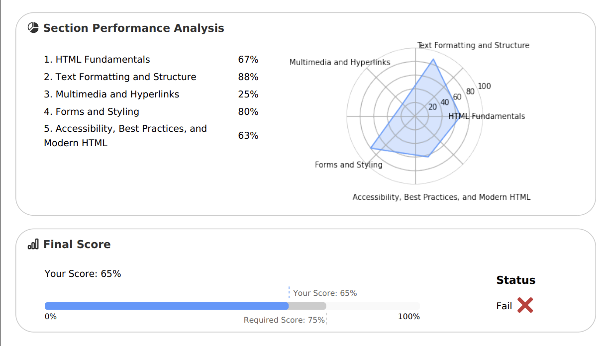
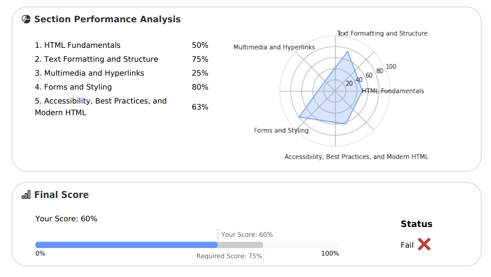

# Final Project Reflection: HTML Certification Retake

For my final project, I chose to study HTML and retake my certification. Before spring break we took our HTML certifications and I unfortunately failed with a 65%. I didn’t really study before my original certification test, so I expected to fail. I was planning on retaking after spring break but I never got to it. I saw this as an opportunity to spend time studying and try to earn my certification.

## What I Did

I read through the whole edube textbook and took the tests at the end of each section. If I failed one of the tests I went back and reread that section. The morning of the retake I went back and reread some of the sections I was still struggling with. I also looked at my test report from my original test. I noticed I had struggled with the multimedia and hyperlinks, and the accessibility sections. I tried to focus on these sections when I was reading the textbook and studying. 

## Results

The test results did not go how I wanted them to. Somehow I managed to get my score lower than it was. I got a 60% on the retake. I got the similar score for each section as I got on the original attempt. 

## Reflection

I am disappointed in myself because I should've at least made some progress. I think one of the reasons I failed again is because of my general inability to take tests. I have had similar issues in the past of retaking tests after studying and my grade going down. Another reason I think I failed is because I haven’t been actively practicing a lot of HTML and I am not great at learning from reading. Overall I don’t think I ever fully understood multimedia and hyperlinks. I spent extra time on them when I was studying but they never fully clicked for me. In the future If I fail a certification exam I am going to try and retake it sooner and not put it off. I also will try and find more studying resources, and try to not only rely on one. 

